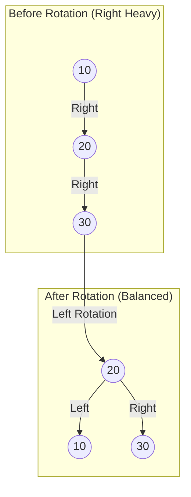

# AVL Tree vs. BST: Performance Benchmarking

## 🔎 Project Overview
This project implements a self-balancing **AVL Tree** in C++ and benchmarks its efficiency against a standard **Binary Search Tree (BST)**. The goal was to empirically demonstrate the necessity of self-balancing algorithms by analyzing tree height ($h$) and time complexity under different load conditions.


## 🚀 Key Features
* **Dual Implementation:** A single engine capable of toggling between BST and AVL logic via the `fixme()` function.
* **Self-Balancing Logic:** Implements standard rotations (Left, Right) to maintain an optimal balance factor.
* **Performance Metrics:** Tracks tree height ($h$) and the ratio $h / \log_2(n)$ to measure deviation from optimal logarithmic depth.

## 📊 The Results
### Visualizing the Rotation
The core of the AVL algorithm is the rotation. Here is how a Left Rotation rebalances a tree when it becomes right-heavy:


Experiments were conducted with dataset sizes ($n$) ranging from 10 to 1,000,000 nodes using both Sequential and Pseudo-Random insertion patterns.

| Experiment | n (Nodes) | Tree Height ($h$) | Ratio ($h/\log n$) | Verdict |
| :--- | :--- | :--- | :--- | :--- |
| **AVL (Sequential)** | 1,000,000 | 20 | **1.00** | 🟢 Perfect Balance |
| **AVL (Random)** | 742,827 | 22 | **1.12** | 🟢 Near-Perfect Balance |
| **BST (Random)** | 742,827 | 164 | **8.41** | 🔴 Significant Degradation |

### Analysis
The data confirms the theoretical advantage of AVL trees.
1.  **AVL Stability:** Under sequential insertion (the worst-case scenario for BSTs), the AVL tree maintained a ratio of **1.0**, effectively serving as a perfectly balanced binary tree.
2.  **BST Degradation:** While the BST performed acceptably at low volumes, it degraded significantly at $n=1,000,000$. The height jumped to **164** (ratio of 8.41), illustrating how standard BSTs become vulnerable to unbalancing even with random data.

## 🛠️ Usage
### 1. Compile
```bash
g++ -o avl_benchmark main.cpp
```

### 2. Run

```bash
./avl_benchmark
```

## 📝 Technical details

  * **Language:** C++
  * **Metrics:** Time complexity analysis via `std::chrono` and Height analysis via recursive traversal.
  * **Rotations:** Implemented `rrotate` and `lrotate` for pointer manipulation during rebalancing.

## 📄 Full Report

For a detailed breakdown of the methodology, the source code includes toggleable logic to reproduce the sequential vs. random insertion experiments.